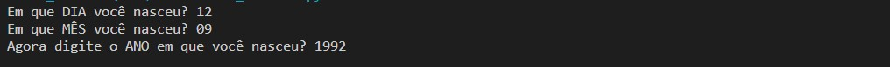
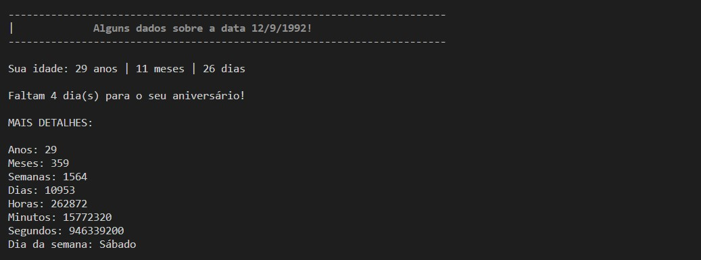
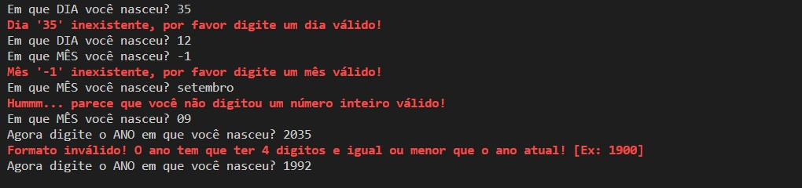

# Calculadora idade++ em Python

Esse script todo feito em **Python**, mostra a quantidade de anos, meses, semanas, dias, horas, minutos, segundos e dia da semana de uma determinada data de nascimento até a data atual, usando apenas a biblioteca **datetime** e **calendar**. 

### Bibliotecas usadas:

```datetime```
```calendar```

### Screenshots:

##### _Recebendo os dados do usuário._




##### _Mostrando os dados para o usuário._



##### _Tratamento de erros._




<h2 align="center">
    <strong>🌟
        Favorite este repositório 
    </strong>🌟
</h2>

<p align="center">
    Criado com ❤️ e python por
        <a href="https://github.com/TrexPD">
            Paulo Daniel (TrexPD)!
        </a> | Licença: MIT © 
</p>
